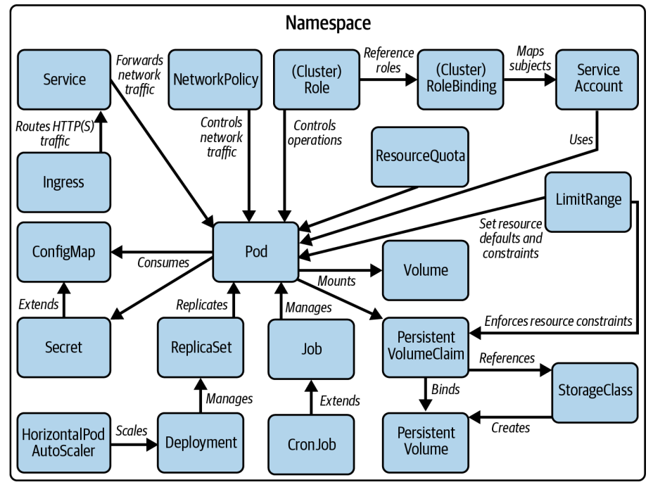

* https://kubernetes.io/docs/tasks/tools/

```bash
minikube start
minikube dashboard
minikube pause
minikube unpause
minikube stop
minikube config set memory 9001
minikube addons list
minikube delete --all
```

* https://kubernetes.io/docs/reference/generated/kubectl/kubectl-commands

* https://docs.linuxfoundation.org/tc-docs/certification/tips-cka-and-ckad#cka-and-ckad-environment

* Remember to switch to the context and namespace of the question

```bash
kubectl config set-context <context-of-question> \
 --namespace=<namespace-of-question>
kubectl config use-context <context-of-question>
```

* `kubectl` comes with `k` alias and auto completitions:

```bash
alias k=kubectl
k version
```

https://kubernetes.io/docs/reference/kubectl/quick-reference/#kubectl-autocomplete


* get a list of default cli short-names:

```bash
kubectl api-resources # returns list

kubectl describe pvc my-claim # example for  persistentVolumeClaim
```

* https://killer.sh/

* learn the text editor: vim (default) or nano

```bash
KUBE_EDITOR="nano" kubectl edit svc/registry
```

* create some alias for the exam:
```bash
alias k='kubectl'
alias kgp='kubectl get pods'
alias kgs='kubectl get svc'
alias kgn='kubectl get nodes'
alias kdp='kubectl describe pod'
alias kds='kubectl describe svc'
alias kdn='kubectl describe node'
alias kl='kubectl logs'
alias kgpns='kubectl get pods --namespace'
```

* avoide graceful delete by forcing and using `--now`:
```bash
kubectl delete pod frontend --now
```

* generate the manifest using `--dry-run=client`, edit it and apply (using imperative commands is the most efficient and quick way to manage objects):

```bash
kubectl run frontend --image=nginx:1.25.1 --port=80 -o yaml --dry-run=client > pod.yaml
vim pod.yaml
kubectl apply -f pod.yaml
```

